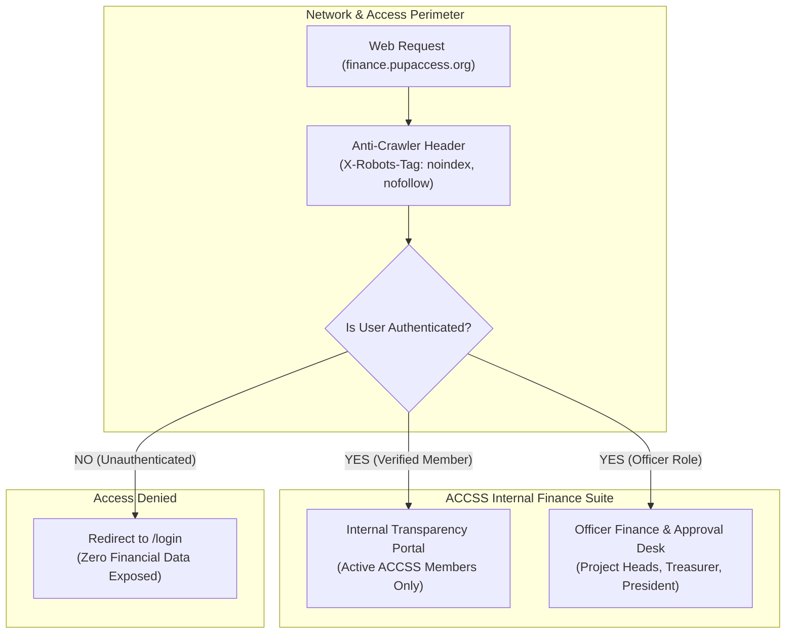
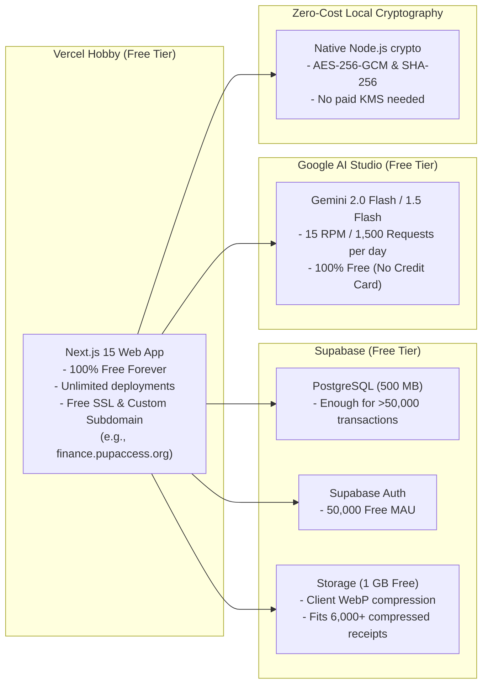
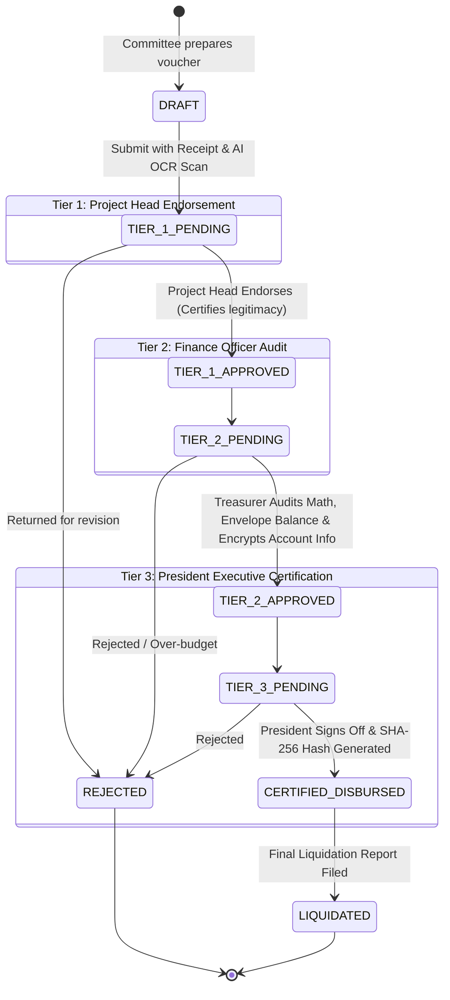
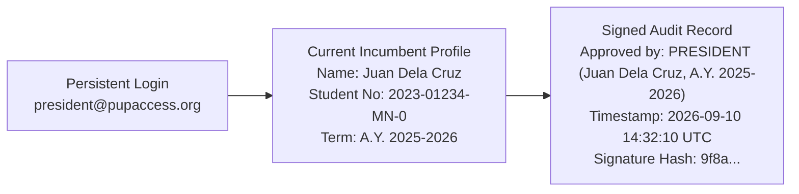

# ACCESS Finance: System Architecture & Technical Design Document

**Organization:** PUP Association of Concerned Computer Engineering Students for Service (PUP ACCESS)  
**Project:** ACCSS Internal Finance & Budget Intelligence Platform (*"ACCESS Vault"*)  
**Scope:** **Strictly Internal Organization-Only Platform** (No Public Access)  
**Status:** Comprehensive Architectural Specification  
**Approved Decisions:**  
1. **100% Internal System:** Zero public internet access. Entire application is protected behind an authentication gate. Unauthenticated visitors cannot see any financial data.  
2. **Zero-Cost Guarantee:** 100% ₱0 deployment and lifetime usage (Vercel Hobby, Supabase Free Tier, Google AI Studio Free Tier).  
3. **Database & Storage:** Supabase Free Tier (PostgreSQL, Row-Level Security, Auth, Storage with WebP image compression).  
4. **Authentication & RBAC:**  
   * **General Organization Members:** Google OAuth restricted to verified ACCESS members / `@pup.edu.ph` institutional accounts.  
   * **Officers & Executive Board:** Persistent Position Accounts (`president@pupaccess.org`, `treasurer@pupaccess.org`, `projecthead.*@pupaccess.org`).  
5. **3-Tier Approval Flow:** Project Head (Tier 1) $\rightarrow$ Treasurer (Tier 2) $\rightarrow$ **President** (Tier 3 Final Executive Sign-Off).  
6. **Design System:** ACCSS Identity (`pupaccess.org`) with `#f26223` Vibrant Orange, `#0a0a0a` Deep Slate, and Geist typography.

---

## 1. Internal-Only Architecture & Access Perimeter

Because this system is exclusively for the organization, the perimeter architecture changes from an open web portal to a **Closed-Loop Intranet Application**:



### Key Architectural Adjustments for "Internal Only":
1. **Zero Public Landing Page:** The root URL (`/`) automatically redirects unauthenticated users to `/login`. No financial figures, event summaries, or budget totals are exposed to external web traffic.
2. **Search Engine Shielding (Anti-Indexing):** All responses return `X-Robots-Tag: noindex, nofollow, noarchive`, and `robots.txt` disallows all crawlers. The site will never appear in Google or Bing search results.
3. **Member Roster Whitelist:** Only verified Computer Engineering students active in PUP ACCESS can log in. Outsiders who attempt to sign in with non-whitelisted Google accounts are blocked at the authentication gate.
4. **Elimination of Duplicate Redacted Storage:** Since the platform is strictly accessible by authenticated organization members, we don't need to generate and store duplicate "redacted" receipts. We only need a single private bucket (`receipts-vault`), saving ~50% of storage space. Sensitive personal banking and GCash account numbers remain encrypted at rest via AES-256-GCM.

---

## 2. Zero-Cost Infrastructure & Lifetime Free Tier Strategy



---

## 3. The 3-Tier Executive Approval State Machine



---

## 4. Persistent Position Accounts with Incumbent Attribution



### Institutional Position Accounts:
* `president@pupaccess.org` (Organization President — Tier 3 Final Approver)
* `treasurer@pupaccess.org` (Finance Officer — Tier 2 Auditor & Disburser)
* `projecthead.hardhatting@pupaccess.org` (Event Committee Lead — Tier 1 Endorser)
* `projecthead.cemonth@pupaccess.org` (Event Committee Lead — Tier 1 Endorser)
* `projecthead.jao@pupaccess.org` (Event Committee Lead — Tier 1 Endorser)

---

## 5. Security & Confidentiality Architecture

1. **Zero-Knowledge Field Encryption (AES-256-GCM):**  
   Reimbursement bank accounts, GCash numbers, and payee mobile numbers are encrypted in Server Actions prior to database insertion. Only the Treasurer and President can decrypt payment details when issuing payouts.
2. **Cryptographic SHA-256 Audit Ledger:**  
   Every transaction certified by the President produces an immutable SHA-256 block chained to the preceding record:
   $$\text{CurrentHash} = \text{SHA256}(\text{PreviousHash} + \text{TrackingNumber} + \text{Amount} + \text{Timestamp} + \text{PresidentID})$$
3. **Internal Transparency (Internal Member View):**  
   Authenticated organization members can inspect event budget allocations, category balances, burn rates, and view supporting receipts, ensuring 100% internal transparency without external internet exposure.
4. **AI Duplicate & Anomaly Shield:**  
   Gemini OCR auto-extracts official receipt numbers and vendors to block duplicate expense submissions across events.

---

## 6. Supabase Database Schema & Field-Level Security

```sql
-- Enums
CREATE TYPE user_role AS ENUM (
  'STUDENT_MEMBER', 
  'PROJECT_HEAD', 
  'FINANCE_OFFICER', 
  'PRESIDENT', 
  'ADMIN'
);

CREATE TYPE transaction_type AS ENUM (
  'DISBURSEMENT', 
  'REIMBURSEMENT', 
  'CASH_ADVANCE', 
  'RETURN_OF_EXCESS', 
  'COLLECTION', 
  'SPONSORSHIP', 
  'REALLOCATION'
);

CREATE TYPE receipt_type AS ENUM (
  'OFFICIAL_RECEIPT_SI', 
  'ACKNOWLEDGMENT_RECEIPT', 
  'CENRR_PETTY_CASH'
);

CREATE TYPE approval_tier AS ENUM (
  'TIER_1_PROJECT_HEAD', 
  'TIER_2_FINANCE_OFFICER', 
  'TIER_3_PRESIDENT'
);

CREATE TYPE transaction_status AS ENUM (
  'DRAFT', 
  'TIER_1_PENDING', 
  'TIER_2_PENDING', 
  'TIER_3_PENDING', 
  'CERTIFIED_DISBURSED', 
  'LIQUIDATED', 
  'REJECTED'
);

-- Member Whitelist (Ensures ONLY ACCSS members can sign in)
CREATE TABLE member_whitelist (
  id UUID PRIMARY KEY DEFAULT gen_random_uuid(),
  email TEXT NOT NULL UNIQUE,
  full_name TEXT NOT NULL,
  student_number TEXT NOT NULL UNIQUE,
  is_active BOOLEAN NOT NULL DEFAULT TRUE,
  created_at TIMESTAMPTZ NOT NULL DEFAULT NOW()
);

-- Profiles Table (Linked to Supabase auth.users)
CREATE TABLE profiles (
  id UUID REFERENCES auth.users(id) ON DELETE CASCADE PRIMARY KEY,
  email TEXT NOT NULL UNIQUE,
  position_title TEXT NOT NULL DEFAULT 'ACCSS Member',
  role user_role NOT NULL DEFAULT 'STUDENT_MEMBER',
  incumbent_name TEXT NOT NULL,
  incumbent_student_no TEXT,
  incumbent_term TEXT NOT NULL,
  created_at TIMESTAMPTZ NOT NULL DEFAULT NOW(),
  updated_at TIMESTAMPTZ NOT NULL DEFAULT NOW()
);

-- Fiscal Years (e.g. A.Y. 2025-2026)
CREATE TABLE fiscal_years (
  id UUID PRIMARY KEY DEFAULT gen_random_uuid(),
  label TEXT NOT NULL,
  start_date DATE NOT NULL,
  end_date DATE NOT NULL,
  is_active BOOLEAN NOT NULL DEFAULT FALSE,
  total_budget_cap NUMERIC(12, 2) NOT NULL DEFAULT 0.00,
  created_at TIMESTAMPTZ NOT NULL DEFAULT NOW()
);

-- Event Budgets (e.g. Hardhatting Ceremony 2026, CE Month)
CREATE TABLE event_budgets (
  id UUID PRIMARY KEY DEFAULT gen_random_uuid(),
  fiscal_year_id UUID NOT NULL REFERENCES fiscal_years(id),
  name TEXT NOT NULL,
  slug TEXT NOT NULL UNIQUE,
  purpose TEXT NOT NULL,
  technique TEXT NOT NULL DEFAULT 'ACTIVITY_BASED',
  total_allocated NUMERIC(12, 2) NOT NULL,
  contingency_buffer NUMERIC(12, 2) NOT NULL DEFAULT 0.00,
  status TEXT NOT NULL DEFAULT 'ACTIVE',
  project_head_id UUID REFERENCES profiles(id),
  created_at TIMESTAMPTZ NOT NULL DEFAULT NOW(),
  updated_at TIMESTAMPTZ NOT NULL DEFAULT NOW()
);

-- Budget Categories (Envelopes within an Event)
CREATE TABLE budget_categories (
  id UUID PRIMARY KEY DEFAULT gen_random_uuid(),
  event_budget_id UUID NOT NULL REFERENCES event_budgets(id) ON DELETE CASCADE,
  name TEXT NOT NULL,
  allocated_amount NUMERIC(12, 2) NOT NULL,
  created_at TIMESTAMPTZ NOT NULL DEFAULT NOW()
);

-- Expense Transactions (Core Ledger)
CREATE TABLE expense_transactions (
  id UUID PRIMARY KEY DEFAULT gen_random_uuid(),
  event_budget_id UUID NOT NULL REFERENCES event_budgets(id),
  category_id UUID NOT NULL REFERENCES budget_categories(id),
  tracking_number TEXT NOT NULL UNIQUE,
  title TEXT NOT NULL,
  description TEXT NOT NULL,
  type transaction_type NOT NULL DEFAULT 'REIMBURSEMENT',
  status transaction_status NOT NULL DEFAULT 'TIER_1_PENDING',
  amount NUMERIC(12, 2) NOT NULL,
  transacted_at TIMESTAMPTZ NOT NULL,
  submitted_by UUID NOT NULL REFERENCES profiles(id),

  -- Encrypted Sensitive Fields (AES-256-GCM zero-cost in-process crypto)
  encrypted_payee_info TEXT,
  encrypted_disbursement_acct TEXT,
  key_version INT NOT NULL DEFAULT 1,

  created_at TIMESTAMPTZ NOT NULL DEFAULT NOW(),
  updated_at TIMESTAMPTZ NOT NULL DEFAULT NOW()
);

-- Transaction Approval Sign-offs
CREATE TABLE transaction_approvals (
  id UUID PRIMARY KEY DEFAULT gen_random_uuid(),
  transaction_id UUID NOT NULL REFERENCES expense_transactions(id) ON DELETE CASCADE,
  tier approval_tier NOT NULL,
  approver_id UUID NOT NULL REFERENCES profiles(id),
  approver_position TEXT NOT NULL,
  approver_incumbent_name TEXT NOT NULL,
  approver_term TEXT NOT NULL,
  action TEXT NOT NULL,
  comments TEXT,
  signature_hash TEXT NOT NULL,
  signed_at TIMESTAMPTZ NOT NULL DEFAULT NOW(),
  UNIQUE(transaction_id, tier)
);

-- Receipts & Supporting Documents (Single Private Vault)
CREATE TABLE receipt_attachments (
  id UUID PRIMARY KEY DEFAULT gen_random_uuid(),
  transaction_id UUID NOT NULL REFERENCES expense_transactions(id) ON DELETE CASCADE,
  receipt_type receipt_type NOT NULL DEFAULT 'OFFICIAL_RECEIPT_SI',
  storage_path TEXT NOT NULL, -- Supabase Storage: 'receipts-vault'
  file_name TEXT NOT NULL,
  file_size INT NOT NULL,
  mime_type TEXT NOT NULL,
  sha256_hash TEXT NOT NULL,
  ai_extracted_json JSONB,
  ai_confidence NUMERIC(4, 3),
  uploaded_at TIMESTAMPTZ NOT NULL DEFAULT NOW()
);

-- Cryptographic Immutable Audit Blocks
CREATE TABLE audit_blocks (
  id UUID PRIMARY KEY DEFAULT gen_random_uuid(),
  transaction_id UUID NOT NULL UNIQUE REFERENCES expense_transactions(id),
  block_index BIGSERIAL UNIQUE,
  previous_hash TEXT NOT NULL,
  current_hash TEXT NOT NULL,
  payload_snapshot JSONB NOT NULL,
  certified_by UUID NOT NULL REFERENCES profiles(id),
  created_at TIMESTAMPTZ NOT NULL DEFAULT NOW()
);
```

---

## 7. Frontend Architecture & ACCSS Design System

```css
/* ACCSS Design System Tokens */
:root {
  --background: #0a0a0a;
  --surface: #121212;
  --surface-card: #171717;
  --surface-border: #262626;
  
  --primary: #f26223;       /* ACCSS Signature Vibrant Orange */
  --primary-hover: #fe6e00;
  --primary-light: #ffb89a;
  
  --text-primary: #ededed;
  --text-secondary: #a1a1aa;
  
  --finance-inflow: #00bb7f;  /* Emerald for surplus & budget available */
  --finance-outflow: #fb2c36; /* Crimson for disbursements & burn rate */
  --finance-audit: #3080ff;   /* Tech Blue for verified cryptographic hashes */
}
```
